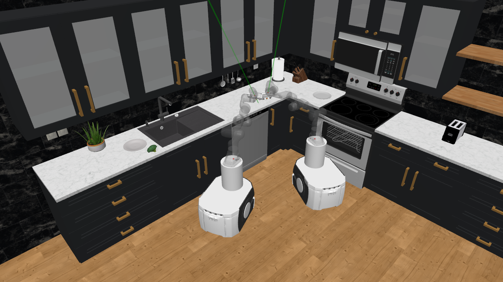
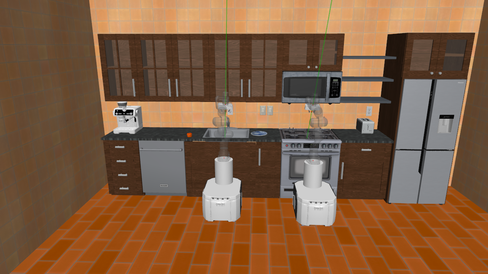

# LLM-multiagent-robocasa
Implement multiagent settings in robocasa and empower them with collaborative skills through LLM.



## Installation
1. set up conda environment, python 3.9 is recommended
```
conda create -c conda-forge -n robocasa python=3.9
conda activate robocasa
```   
2. install ```robosuite``` module in editable mode, branch：robocasa_v0.1
```
cd robosuite
pip install -e .
```
3. install ```robocasa``` module in editable mode, branch：main
```
cd robocasa
pip install -e .
conda install -c numba numba -y
python robocasa/scripts/download_kitchen_assets.py
python robocasa/scripts/setup_macros.py
```
4. install ```robomimic``` module in editable mode, branch: robocasa
```
cd robomimic
pip install -e .
```

## Teleoperate
```
cd robocasa
# teleoperate on single-agent or multi-agent tasks
python robocasa/demos/multi_teleop_test.py 
```
## Validation
```
cd robomimic
# validate a single-task trained agent in the training environment
python robomimic/scripts/run_trained_singletask_agent_template.py
# validate a single-task trained agent in a single-task one-agent environment
python robomimic/scripts/run_trained_singletask_agent.py
# validate a single-task trained agent in a multi-task one-agent environment
python robomimic/scripts/run_trained_multitask_agent.py
# validate a single-task trained agent in a multi-task two-agent environment
python robomimic/scripts/run_trained_multitask_twoagent.py 
```
